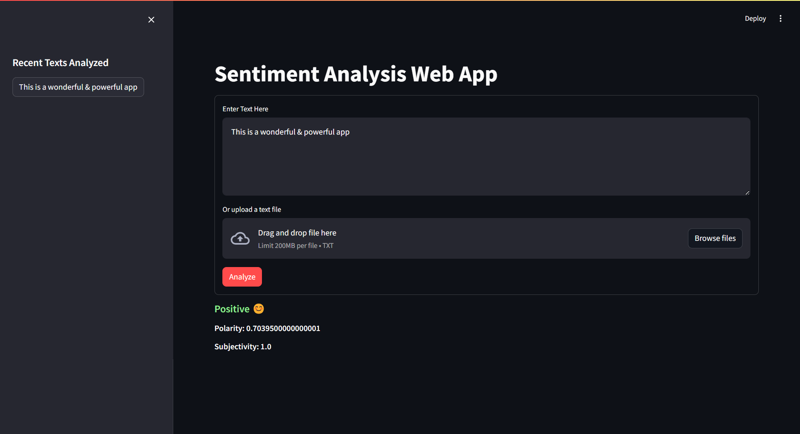

# Sentiment Analysis Web App

The app utilizes two popular sentiment analysis libraries, TextBlob and VADER, to provide comprehensive insights into the sentiment of the text.

## Key Features
- **Dual Sentiment Analysis:** Utilizes both TextBlob and VADER sentiment analysis libraries for enhanced accuracy.
- **User-Friendly Interface:** Simple and intuitive user interface makes it easy for users to input text for analysis.
- **History Tracking:** Keeps track of the recent texts analyzed, allowing users to quickly revisit previous analyses.

## Usage
1. **Input Text:** Enter or paste the text you want to analyze into the text area provided.
2. **File Upload:** Alternatively, you can upload a text file for analysis.
3. **Analyze:** Click the "Analyze" button to perform sentiment analysis on the entered text.
4. **View Results:** The sentiment analysis results, including polarity and subjectivity, will be displayed along with emoji representations.

